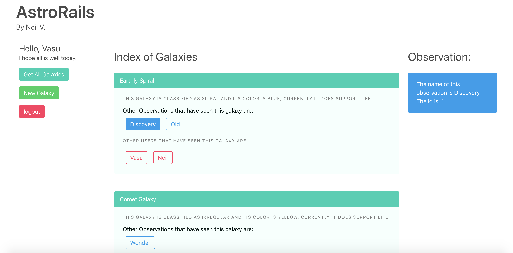

# Welcome to AstroRails 
## A RESTful app to log your discoveries across the cosmos.

#Blog

Link to Article:
[Medium](https://medium.com/@neilvseejoor/restful-routes-in-rails-8fc2b0d66dd6)

# Getting Started
* Clone this repository
* cd into the project folder
* Run
`bundle install && rails db:migrate && rails s`
* Navigate to `http://localhost:3000`
* Enjoy!

# Authors
* **Neil V.** - *Initial work* - [Github](https://github.com/urbanvas)

## Contributing

Bug reports and pull requests are welcome on GitHub at https://github.com/urbanvas/observationalrails. This project is intended to be a safe, welcoming space for collaboration, and contributors are expected to adhere to the [Contributor Covenant](http://contributor-covenant.org) code of conduct.

## License

The app is available as open source under the terms of the [MIT License](https://opensource.org/licenses/MIT).

## Code of Conduct

Everyone interacting in the ObservationalRails project’s codebases, issue trackers, chat rooms and mailing lists is expected to follow the code of conduct.

